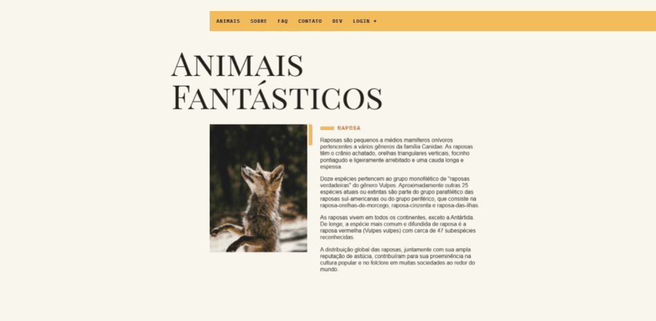

# Animais Fantásticos (Fantastic Beasts)

Animais Fantásticos (Fantastic Beasts) is a website project developed during the JavaScript ES6+ course at [Origamid.com](https://www.origamid.com/). This project showcases a variety of skills learned by creating various effects from scratch using JavaScript.

## Demo

[Click here](https://barata-ribeiro.github.io/animais-fantasticos/) to see a live demo of the website.



## Introduction

Following closed instructions, this project demonstrates a mastery of front-end development with JavaScript, showcasing creativity and practical application of programming knowledge. With every script developed from scratch, such as a login modal, a dropdown menu to help navigate to different sections, and a smooth scroll with animations to enhance the user experience. A frequently asked questions (FAQ) list is also implemented with a show/hide system using JavaScript.

To further showcase the capabilities of JavaScript, a custom API is created to display the numbers of each animal in the Fantastic Beasts world. In addition, the project includes contact information, with a Bitcoin API integrated to display real-time donation values and a fictitious map with a tooltip containing directions and instructions.

## Technologies Used

-   HTML
-   CSS
-   JavaScript

## Features

-   Responsive design using CSS Grid Layout and Flexbox
-   Clean and modern layout
-   Easily customizable
-   Custom API for animal list and amount
-   Slide gallery with all animals
-   BTC API to display donation price

## Getting Started

To get started with this project, follow these steps:

1. Clone the repository:

```
git clone https://github.com/Barata-Ribeiro/animais-fantasticos.git
```

2. Navigate to the project folder:

```
cd animais-fantasticos
```

3. Open the `index.html` file in your browser or use LiveServer.

4. Explore and modify the code to suit your needs.

## Contributing and Modifying the project

If you find any issues or have suggestions for improvements, feel free to open an issue or submit a pull request.

1. After cloning the repository, run the script to install dependencies:

```
npm install
```

2. Then you create a branch of the project:

```
git checkout -b branch-name
```

3. Run the `dev` script to update live.

```
npm run dev
```

4. Make all the necessary changes to the project...

5. Stop the `dev` script and run the `build` script:

```
npm run build
```

6. Commit your changes and push to main repository.

7. Create a pull request...

## License

This project is released under the [MIT License](LICENSE).
